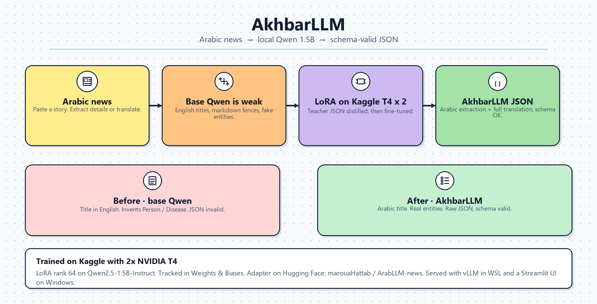
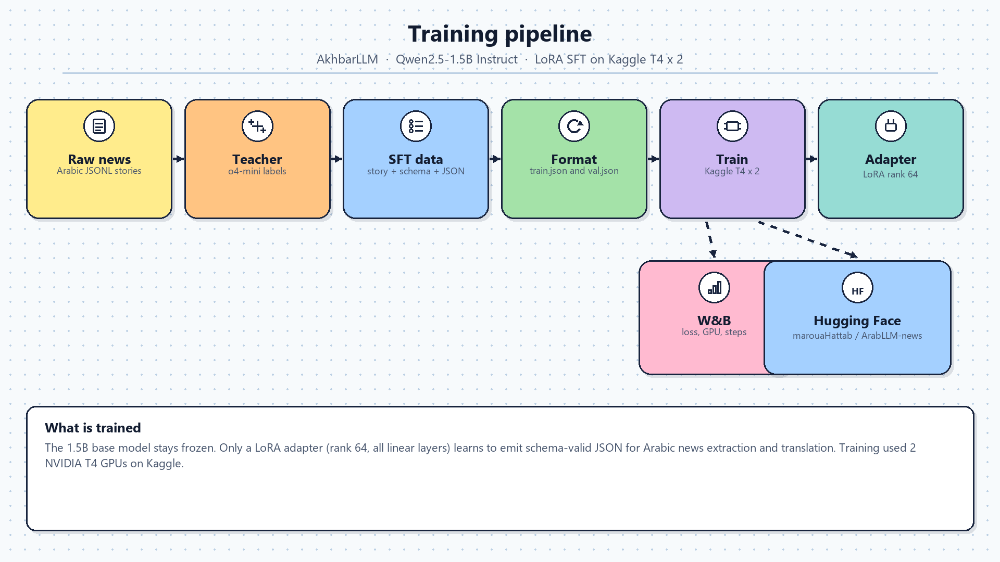
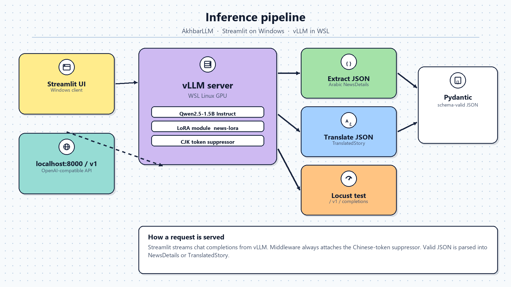

# AkhbarLLM

**Fine-tuning a 1.5B model to match teacher-quality Arabic news NLP — self-hosted, zero per-request cost.**

Complete pipeline: labeled data from OpenAI `o4-mini`, LoRA fine-tuning via LLaMA-Factory on **Kaggle T4 × 2**, production serving with vLLM in WSL, and a Streamlit UI with token streaming.

Adapter: [marouaHattab/ArabLLM-news](https://huggingface.co/marouaHattab/ArabLLM-news) · Training: [Weights & Biases](https://wandb.ai/marouahattab3-cole-polytechnique/llamafactory?nw=nwusermarouahattab3) · Demo: [Streamlit + vLLM walkthrough](https://drive.google.com/file/d/1xSs2JlxuCeDHPiIetVMTGWxGXMmmIk_i/view?usp=sharing)

---

## The Problem

Arabic news NLP needs structured output from unstructured text: titles, keywords, summaries, named entities, categories, and translations. A teacher model does this well, but it costs money at scale and cannot be self-hosted.

Base `Qwen/Qwen2.5-1.5B-Instruct` is free to run, but it is **bad at Arabic** on this task. It answers in English, wraps JSON in markdown fences, and invents entities (`Person`, `Location`, `Disease`) that are not in the story.

**The approach:** use `o4-mini` once to generate high-quality labeled JSON, then LoRA-fine-tune Qwen 1.5B on that data on **Kaggle (2× NVIDIA T4)**. The result is a self-hosted adapter that emits the same schema-valid JSON on this task, at zero per-request cost.

---

## Architecture

<p align="center">
  
</p>

Two distinct phases:

**Training** — `o4-mini` labels raw Arabic news. Those labels are formatted into SFT pairs and used to fine-tune Qwen2.5-1.5B with LoRA via LLaMA-Factory on **Kaggle T4 × 2**. Runs are tracked on Weights & Biases and the adapter is pushed to Hugging Face.

**Inference** — Arabic text goes through a prompt builder, is sent to a vLLM server in WSL with the LoRA adapter hot-loaded, then validated against a Pydantic schema and returned as structured JSON.

<p align="center">
  
</p>

<p align="center">
  
</p>

---

## Base Qwen vs AkhbarLLM

Same story (`data/examples/story.txt`), same prompts. Reports: `outputs/Evaluation/qwen-base-evaluation.txt` and `outputs/Evaluation/qwen-finetuned-evaluation.txt`.

| | Base Qwen 1.5B | AkhbarLLM |
| --- | --- | --- |
| Extraction language | English | **Arabic** |
| JSON parse | Fail (```json fence) | **Pass** |
| Schema (`NewsDetails` / `TranslatedStory`) | Fail | **Pass** |
| Entities | Invented enum names | Story-grounded (فوربس, شاين إنيت) |
| Translation | One sentence | Full article |

**Base — extraction (invalid JSON)**

```json
{
  "story_title": "Family Influence on Financial Relationships",
  "story_keywords": ["Forbes", "Financial Therapy Association", "Money Genogram"],
  "story_entities": [
    { "entity_value": "Person", "entity_type": "person-male" },
    { "entity_value": "Location", "entity_type": "location" },
    { "entity_value": "Disease", "entity_type": "disease" }
  ]
}
```

**AkhbarLLM — extraction (valid JSON)**

```json
{
  "story_title": "دور العائلة في تشكيل علاقة الأفراد بالمال",
  "story_keywords": ["العائلة", "العلاقة بالمال", "الشخصية المالية", "الثروة", "الإنفاق"],
  "story_category": "economy",
  "story_entities": [
    { "entity_value": "فوربس", "entity_type": "organization" },
    { "entity_value": "شاين إنيت", "entity_type": "person-male" },
    { "entity_value": "رابطة العلاج المالي", "entity_type": "organization" }
  ]
}
```

---

## Fine-tuning pipeline

Copy `src/.env.example` to `src/.env` and set `HF_TOKEN`, `WANDB_API_KEY`, `OPENAI_API_KEY`.

```powershell
uv sync --group distillation --group train --group evaluation
```

### 1. Generate labeled data with o4-mini

Raw Arabic news (`data/raw/news-sample.jsonl`) goes in. The teacher returns structured JSON following the Pydantic schema.

```python
uv run --group distillation python -m src.workflows.generate_distillation_dataset
```

Output per record (`data/datasets/sft.jsonl`):

```json
{
  "id": 1,
  "story": "ذكرت مجلة فوربس أن العائلة تلعب دورا محوريا...",
  "task": "Extract the story details into a JSON object according to the provided schema.",
  "output_schema": { },
  "response": {
    "story_title": "دور العائلة في تشكيل علاقة الأفراد بالمال",
    "story_keywords": ["العائلة", "العلاقة بالمال", "فوربس"],
    "story_summary": ["العائلة تؤثر على علاقة الأفراد بالمال"],
    "story_category": "economy",
    "story_entities": [
      { "entity_value": "فوربس", "entity_type": "organization" }
    ]
  },
  "teacher_model": "o4-mini"
}
```

### 2. Format for LLaMA-Factory

```python
uv run --group train python -m src.workflows.format_finetuning_dataset
```

Produces `data/datasets/llama_factory/train.json` (2700) and `val.json` (66) in LLaMA-Factory SFT format (`system`, `instruction`, `output`).

### 3. Register the dataset and copy the YAML

```python
uv run --group train python -m src.workflows.prepare_finetuning --llamafactory-dir LlamaFactor
```

That logs into Hugging Face and W&B, then writes `LlamaFactor/data/dataset_info.json`:

```json
{
  "news_finetune_train": {
    "file_name": "/path/to/data/datasets/llama_factory/train.json",
    "columns": {
      "prompt": "instruction",
      "query": "input",
      "response": "output",
      "system": "system",
      "history": "history"
    }
  },
  "news_finetune_val": {
    "file_name": "/path/to/data/datasets/llama_factory/val.json",
    "columns": {
      "prompt": "instruction",
      "query": "input",
      "response": "output",
      "system": "system",
      "history": "history"
    }
  }
}
```

Register only:

```python
uv run --group train python -m src.workflows.register_llamafactory_datasets --llamafactory-dir LlamaFactor
```

### 4. Train with LoRA on Kaggle T4 × 2

```bash
cd LlamaFactor
llamafactory-cli train examples/train_lora/news_finetune.yaml
```

```yaml
model_name_or_path: Qwen/Qwen2.5-1.5B-Instruct
finetuning_type: lora
lora_rank: 64
lora_target: all
dataset: news_finetune_train
eval_dataset: news_finetune_val
num_train_epochs: 3
learning_rate: 1.0e-4
per_device_train_batch_size: 1
gradient_accumulation_steps: 4
fp16: true
report_to: wandb
run_name: newsx-qwen2.5-1.5b-lora
```

Config source: `configs/llamafactory/news_finetune.yaml`. Training used **Kaggle GPU T4 × 2** (DDP, effective batch 8). Tracked on W&B: [llamafactory](https://wandb.ai/marouahattab3-cole-polytechnique/llamafactory?nw=nwusermarouahattab3). Adapter on Hugging Face: [marouaHattab/ArabLLM-news](https://huggingface.co/marouaHattab/ArabLLM-news).

---

## Evaluate

```python
uv run --group evaluation python -m src.workflows.evaluate_models --model qwen --task both --output outputs/Evaluation/qwen-base-evaluation.txt
uv run --group evaluation python -m src.workflows.evaluate_models --model finetuned --task both --output outputs/Evaluation/qwen-finetuned-evaluation.txt
uv run --group evaluation python -m src.workflows.evaluate_models --model gemini --task both
uv run --group evaluation python -m src.workflows.evaluate_models --model openai --task both
uv run --group evaluation python -m src.workflows.evaluate_models --model all --task both
```

`--task` is `extraction`, `translation`, or `both`. `--story` points at any UTF-8 file.

Latency / tokens (not schema checks):

```python
uv run --group evaluation python -m src.workflows.benchmark_models --model both --samples 30
```

Through the live vLLM server:

```python
uv run --group serve python -m src.workflows.infer_vllm --task both
```

---

## Serving with vLLM

vLLM 0.7.2 is Linux-only. On Windows, run it **inside WSL2** (NVIDIA driver with WSL GPU; `nvidia-smi` must work in Ubuntu). Adapter path: `outputs/models/news-finetune/`.

### Start server

From PowerShell:

```powershell
.\deployment\vllm\serve.ps1
```

Inside WSL:

```bash
bash deployment/vllm/serve.sh
```

Equivalent process (what the script starts):

```bash
python -m vllm.entrypoints.openai.api_server \
  --host 0.0.0.0 \
  --port 8000 \
  --model Qwen/Qwen2.5-1.5B-Instruct \
  --dtype half \
  --gpu-memory-utilization 0.90 \
  --max-model-len 2048 \
  --max-num-seqs 1 \
  --enforce-eager \
  --enable-lora \
  --max-lora-rank 64 \
  --lora-modules "news-lora=outputs/models/news-finetune" \
  --middleware src.serving.middleware.enforce_chinese_suppression \
  --logits-processor-pattern '^src\.models\.vllm_logits_processors\.ChineseTokenSuppressor$'
```

> T4 / sm_75: FlashAttention2 wants sm_80+, so the server uses `--enforce-eager`. Middleware always attaches a CJK token suppressor so Chinese vocab IDs are not sampled on Arabic news.

Wait until `news-lora` is listed:

```python
uv run --group serve python -m src.workflows.check_vllm --wait
```

Stop:

```powershell
.\deployment\vllm\stop.ps1
```

```bash
bash deployment/vllm/stop.sh
```

### Call the API

```python
import requests

response = requests.post("http://localhost:8000/v1/completions", json={
    "model": "news-lora",
    "prompt": prompt,
    "max_tokens": 512,
    "temperature": 0.3,
})
```

Chat completions (what Streamlit uses) hit `http://localhost:8000/v1/chat/completions`.

### Run the UI

```python
uv run --group app streamlit run app.py
```

Set `NEWS_MODEL_PROVIDER=vllm` in `src/.env`. Direct PEFT load (no vLLM): `NEWS_MODEL_PROVIDER=finetuned`.

Walkthrough of the live UI and vLLM serving: [demo.mp4](https://drive.google.com/file/d/1xSs2JlxuCeDHPiIetVMTGWxGXMmmIk_i/view?usp=sharing).

---

## Load testing

20 concurrent users, 60 seconds, Arabic fake text (`Faker ar_SA`) per request. vLLM must already be running.

```bash
uv run --group serve locust -f tests/load/locustfile.py \
  --headless \
  --host=http://localhost:8000 \
  -u 20 -r 1 -t 60s \
  --html=outputs/LoadTesting/locust-results.html
```

Token analysis after the test:

```python
uv run --group serve python -m src.workflows.analyze_vllm_load
```

Writes `outputs/LoadTesting/token-summary.txt` and `token-summary.json` (`records`, `total_input_tokens`, `total_output_tokens`). Successful prompt/response pairs are in `outputs/LoadTesting/vllm-tokens.jsonl`. Open the HTML report in Chrome or Edge.

---

## Output schemas

**Details extraction** (`NewsDetails`)

```json
{
  "story_title": "string (5–100 chars)",
  "story_keywords": ["string"],
  "story_summary": ["string (1–5 points)"],
  "story_category": "politics | sports | art | technology | economy | health | entertainment | science | not_specified",
  "story_entities": [
    {
      "entity_value": "string",
      "entity_type": "person-male | person-female | location | organization | event | time | quantity | money | product | law | disease | artifact | not_specified"
    }
  ]
}
```

**Translation** (`TranslatedStory`)

```json
{
  "translated_title": "string",
  "translated_content": "string"
}
```

---

## Project structure

```
news-finetuning/
├── app.py                                 # Streamlit entry
├── configs/llamafactory/
│   └── news_finetune.yaml                 # LoRA SFT config (Kaggle T4 × 2)
├── data/
│   ├── raw/news-sample.jsonl              # unlabeled Arabic news
│   ├── datasets/sft.jsonl                 # teacher SFT records
│   ├── datasets/llama_factory/            # train.json, val.json
│   └── examples/story.txt                 # eval story
├── deployment/vllm/
│   ├── serve.ps1 / serve.sh               # start vLLM in WSL
│   └── stop.ps1 / stop.sh
├── docs/assets/                           # architecture diagrams
├── outputs/
│   ├── Evaluation/                        # base vs fine-tuned reports
│   ├── LoadTesting/                       # Locust HTML + token summary
│   └── models/news-finetune/              # local LoRA adapter
├── src/
│   ├── workflows/
│   │   ├── generate_distillation_dataset.py
│   │   ├── format_finetuning_dataset.py
│   │   ├── register_llamafactory_datasets.py
│   │   ├── prepare_finetuning.py
│   │   ├── evaluate_models.py
│   │   ├── benchmark_models.py
│   │   ├── check_vllm.py
│   │   ├── infer_vllm.py
│   │   └── analyze_vllm_load.py
│   ├── models/                            # Qwen, LoRA, vLLM, Gemini, OpenAI
│   ├── tasks/                             # extraction + translation prompts
│   ├── templates/
│   ├── serving/middleware.py              # CJK suppressor
│   └── ui/streamlit_app.py
├── tests/load/locustfile.py
└── LlamaFactor/                           # LLaMA-Factory checkout
```

---

## Skills

**LLM fine-tuning** — LoRA (PEFT), SFT data generation, LLaMA-Factory, knowledge distillation, Weights & Biases, Hugging Face Hub

**Production serving** — vLLM, LoRA adapter hot-loading, OpenAI-compatible API, streaming inference, CJK logits suppression

**NLP** — Arabic news, structured extraction, named entities, translation, schema-injected prompts

**Engineering** — Pydantic v2, factory pattern, JSONL pipelines, Locust load tests, Streamlit

**Infrastructure** — CUDA on Kaggle T4 × 2, WSL2 GPU serving on Windows, uv / Python 3.12

---

## Stack

| | |
| --- | --- |
| Base model | Qwen/Qwen2.5-1.5B-Instruct |
| Fine-tuning | LLaMA-Factory · LoRA rank 64 · all linear layers |
| Teacher | o4-mini |
| Serving | vLLM 0.7.2 · WSL |
| UI | Streamlit |
| Tracking | Weights & Biases |
| Hub | [marouaHattab/ArabLLM-news](https://huggingface.co/marouaHattab/ArabLLM-news) |
| GPU (train) | Kaggle NVIDIA T4 × 2 |
| Language | Python 3.12 |

---

## Numbers

| Metric | Value |
| --- | --- |
| Raw stories | 2400 |
| SFT samples | 2766 (2700 train / 66 val) |
| LoRA rank | 64 |
| Train GPUs | 2× T4 (Kaggle) |
| Effective batch | 8 |
| Epochs | 3 |
| Learning rate | 1e-4 cosine |
| Cutoff / serve context | 3500 / 2048 tokens |
| Best val loss | 0.346 (step 600) |
| Final val loss | 0.3619 (step 1000) |
| Load test | 20 users · 60s |
| Served model id | `news-lora` |
